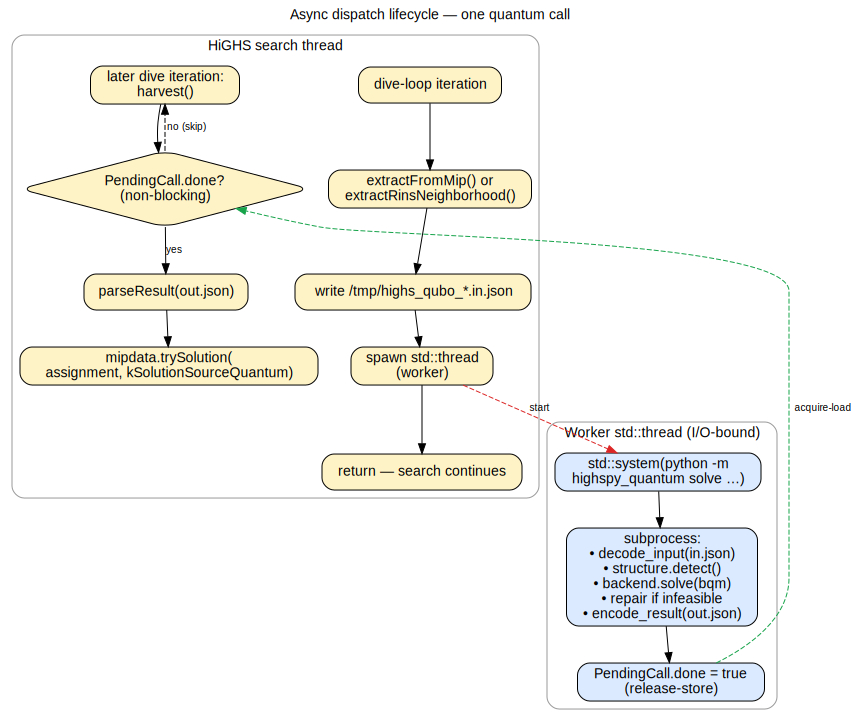
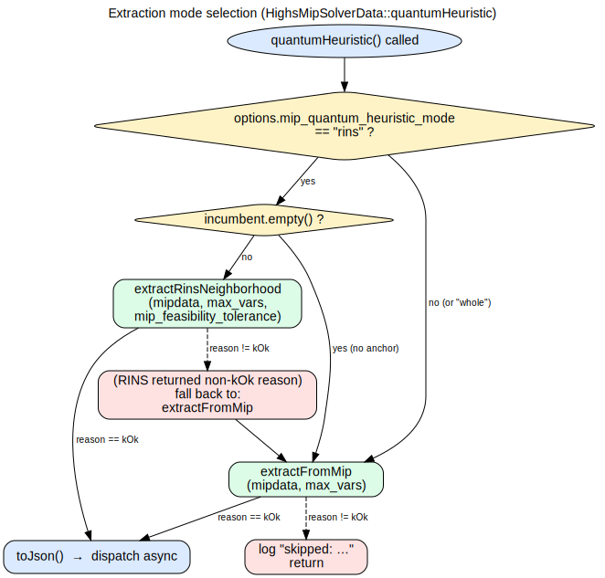
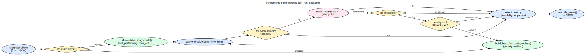
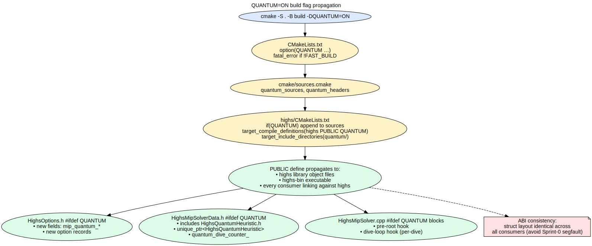

# Architecture

Three layers, one subprocess boundary. The Python package is shared
between the standalone CLI and the C++ heuristic — same code, two entry
points.

## C++ ⇄ Python boundary: why subprocess + JSON

The decision matrix from the original design:

| Option | Latency | Runtime deps | Verdict |
|---|---|---|---|
| Embedded CPython (pybind11 reverse) | low | `highs` binary gains hard Python dep | rejected — too invasive |
| Local HTTP service | medium | sidecar process management | rejected — overkill for POC |
| Subprocess + JSON files | high startup, dominated by cloud round-trip | `python3` on PATH only | **picked** |

Per-call overhead is ~100ms for `python3 -m highspy_quantum solve`
startup. That's negligible against a typical cloud-backend round-trip
(seconds), and for local backends the budget is generally generous
enough that 100ms doesn't matter.

The subprocess sees the JSON the C++ side wrote at `/tmp/highs_qubo_*.in.json`
and writes a result JSON to `/tmp/highs_qubo_*.out.json`. Both are deleted
after harvest. Schema is documented in
[`highspy_quantum/protocol.py`](../python/highspy_quantum/protocol.py)
and `highs/quantum/HighsQubo.h`.

## Async dispatch lifecycle

The C++ side does NOT block the HiGHS search thread on the subprocess
call. Each dispatch spawns a `std::thread` that runs the subprocess and
sets an atomic `done` flag on completion; the search thread polls those
flags at every dive-loop iteration via `harvest()`.

Why `std::thread` instead of HiGHS's `highs::parallel::spawn`? The HiGHS
task pool sizes are tuned for fine-grained CPU-bound parallel work; a
blocking subprocess wait in a pool worker would tie up a pool slot for
seconds, starving the rest of HiGHS's parallelism. I/O-bound work goes
on its own OS thread.

The 64-byte / trivially-destructible constraint on `highs::parallel::spawn`
callables (per `HighsTask.h:94-97`) reinforces this: forwarding a
`PendingCall` context plus an `InvocationConfig` copy doesn't fit, and
heap-allocating just for that adds boilerplate for no benefit.

## Extraction paths

`HighsMipSolverData::quantumHeuristic()` chooses between two extraction
modes based on the `mip_quantum_heuristic_mode` option:

- `whole` — ship the entire (presolved) MIP each time. Default.
- `rins` — fix integer variables whose LP relaxation value matches the
  incumbent (within `mip_feasibility_tolerance`); ship the
  reduced-binary sub-MIP. Falls back to `whole` when no incumbent
  exists yet or the LP relaxation hasn't run.

The RINS path mirrors the variable-fixing semantics of HiGHS's
existing `HighsPrimalHeuristics::RINS` at
`highs/mip/HighsPrimalHeuristics.cpp:601-750`, but does NOT call its
`solveSubMip()` — that would recursively spin up a `HighsMipSolver`,
defeating the purpose of using a quantum backend.

## Python-side solve pipeline

Inside the subprocess, `_run_backend` in `cli.py` orchestrates:

1. **Structure detection** — `structure.detect(sub)` returns a tag like
   `set_partitioning`, `max_cut`, `qubo`, `tsp`, or empty.
2. **BQM construction** — a tagged subproblem uses the specialized
   builder in `reformulation/<tag>.py` (compact, no penalty tuning).
   Untagged falls through to `build_bqm_from_subproblem()` (generic
   penalty method).
3. **Backend solve** — vendor SDK call. Returns ≥0 samples.
4. **Repair** — for each infeasible sample, run a greedy round-and-repair
   pass (`repair.py`). Cheap (~ms); often turns a near-feasible
   quantum sample into a usable HiGHS incumbent.
5. **Selection** — best by `(feasibility, original-objective)`.
6. **Escalation** — if every sample is infeasible after repair, double
   the penalty and retry (≤4 doublings within the time budget).
7. **Encode** — write the result JSON.

## Build system pitfalls

**The QUANTUM define must be PUBLIC, not PRIVATE.** `HighsOptions.h` is
part of the public C++ API, and its struct layout depends on
`#ifdef QUANTUM`. With PRIVATE, the library has fields the consumer
(e.g. the `highs-bin` app target) doesn't see — leading to a layout
mismatch and a segfault during `passOptions()`. This was the first
real bug discovered in Sprint 0.

**The unique_ptr destruction site needs the full type.** Forward-declaring
`HighsQuantumHeuristic` while holding a `std::unique_ptr<>` member in
`HighsMipSolverData` triggers compiler errors at any TU that instantiates
the implicit destructor — `HighsCutPool.cpp`, `HighsDomain.cpp`, etc.
We include the full header in `HighsMipSolverData.h` under
`#ifdef QUANTUM` to side-step this.

## JSON parser hardening

The result-side parser is hand-rolled (no `nlohmann/json` dependency).
For safety against malformed input:

- Try/catch around the entire `parseResult` body.
- 64 MiB cap on input size.
- 16M cap on array length.
- Returns `QuboResult{ok=false, error=…}` on any parse failure — never
  crashes the host process.

## See also

- [extending](extending.md) — adding a backend or a structure detector
- [theory](theory.md) — the math behind reformulation, repair, RINS
