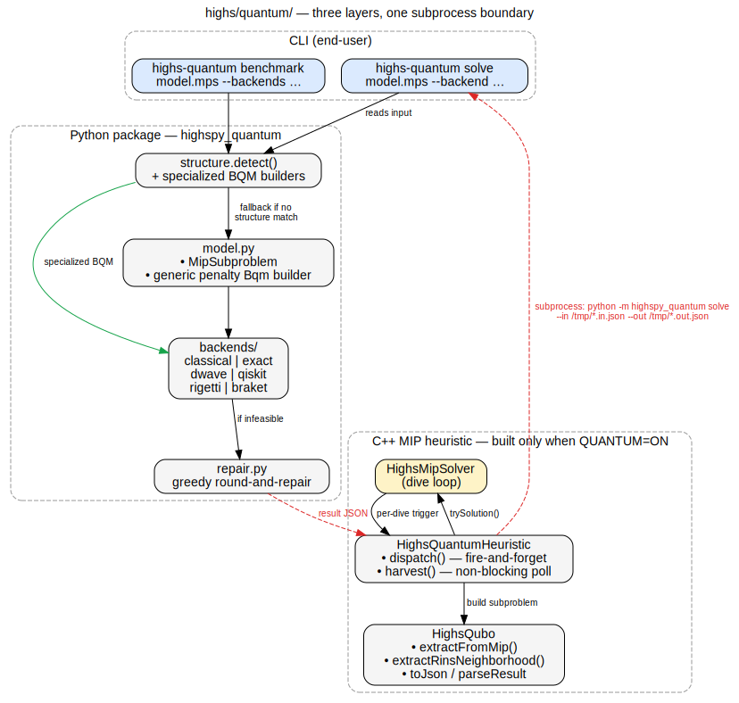

# Quantum-assisted MIP heuristics for HiGHS

A proof-of-concept that dispatches binary-MIP subproblems from HiGHS's
branch-and-bound search to quantum or quantum-inspired backends —
D-Wave annealing, IBM Qiskit QAOA, Rigetti, AWS Braket, plus classical
fallbacks — and lifts feasible results back as primal incumbents.



## Where to start

| You are… | Start here |
|---|---|
| Trying it from the command line | [installation](installation.md) → [cli](cli.md) |
| Already a HiGHS user, want to enable it | [hooked-into-highs](hooked-into-highs.md) → [backends](backends.md) |
| Adding a new backend or structure detector | [architecture](architecture.md) → [extending](extending.md) |
| Reading the QUBO reformulation theory | [theory](theory.md) |
| Hitting an error | [troubleshooting](troubleshooting.md) |

## 60-second pitch

HiGHS solves linear / mixed-integer / quadratic programs classically.
Some MIPs — especially structured ones like max-cut, set partitioning,
or TSP — have natural QUBO formulations that quantum hardware can sample.
This subproject:

1. **Detects** when an LP/MIP subproblem is QUBO-friendly.
2. **Dispatches** it to a chosen backend asynchronously (cloud round-trips
   don't block the MIP search thread).
3. **Lifts** the returned binary assignment back into a HiGHS primal
   incumbent via `trySolution`.

Hits and misses both work: a feasible quantum sample improves the primal
bound; an infeasible one is rejected with no impact on correctness.
HiGHS continues to drive the dual side classically.

## Canonical commands

Standalone (no HiGHS build needed):
```
pip install 'highspy-quantum[dwave]'   # or [qiskit], [rigetti], [braket]
highs-quantum solve maxcut.mps --backend classical
highs-quantum benchmark maxcut.mps --backends classical,exact,dwave
```

Hooked into HiGHS (requires `-DQUANTUM=ON` build):
```
highs model.mps --options_file q.txt
```
where `q.txt` is:
```
mip_quantum_heuristic = classical
quantum_python_executable = python3
quantum_time_limit = 5.0
```

## Project status

This is a **research POC**, not a production solver enhancement. It
demonstrates the integration works end-to-end; it does not claim to
beat classical heuristics on real workloads today. See
[theory](theory.md) for the honest take on penalty-method brittleness
and current hardware scale.
