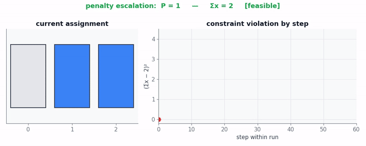
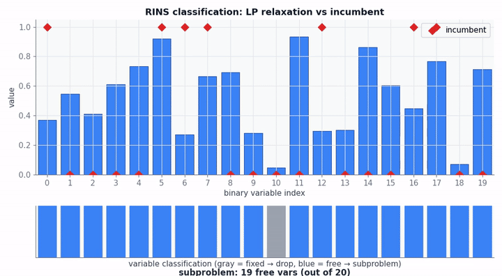
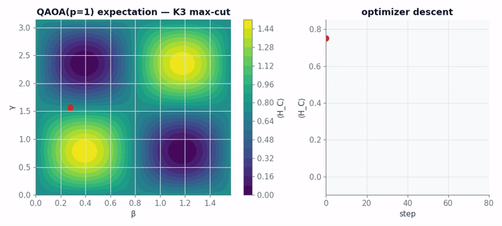
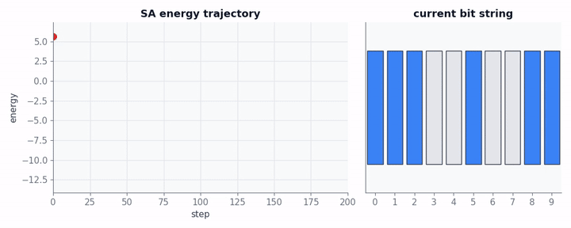

# Theory: QUBO reformulation, repair, RINS

Honest about what works and what doesn't. This is a POC; nothing here
beats classical MIP solvers on real workloads today. The value is in
the integration and the benchmarking harness, not in absolute
performance.

## QUBO and Ising — the model space

A QUBO is

  min  x^T Q x   for x ∈ {0, 1}^n

A QUBO is equivalent (up to constants) to an Ising model

  min  h^T z + z^T J z   for z ∈ {-1, +1}^n

via z = 1 - 2x. Conversions are in
[`highspy_quantum/backends/rigetti.py`](../python/highspy_quantum/backends/rigetti.py)
(`_bqm_to_ising`) — Rigetti and Braket both want Ising form for QAOA
cost-Hamiltonian construction.

Every backend in this project ultimately consumes a QUBO (or its Ising
equivalent). The interesting work is **how a constrained MIP becomes a
QUBO**.

## Penalty method

A general linear constraint `l ≤ a^T x ≤ u` is *not* native to QUBO —
QUBOs are unconstrained. The standard trick is to add a penalty term to
the objective:

  Equality (l = u = b):    P · (a^T x − b)²
  Inequality with upper:   P · max(0, a^T x − u)²
  Inequality with lower:   P · max(0, l − a^T x)²

Expand the square:

  (a^T x − b)² = b² − 2b a^T x + (a^T x)²
              = b² − 2b a^T x + Σ_i a_i² x_i² + 2 Σ_{i<j} a_i a_j x_i x_j

Binary variables satisfy x² = x, so the diagonal collapses into linear
terms. The result is a QUBO contribution per constraint.

Implementation: `_add_quadratic_form()` in
[`highspy_quantum/model.py`](../python/highspy_quantum/model.py).

### Why it's brittle

The penalty weight P needs to be large enough that any feasible point
beats every infeasible one. Default heuristic:
`P = max(1, max|c_j| · num_vars)`. Too small → backend returns
infeasible samples. Too large → the objective contribution is dwarfed by
the constraint cliff, and the QPU / SA can't distinguish optima.

**Mitigations in this project:**

1. **Specialized reformulations** — for known structures (set partitioning,
   max-cut), use compact closed forms from the literature that don't need
   penalty tuning. See `highspy_quantum/reformulation/`.
2. **Adaptive escalation** — if the best sample is infeasible, double P
   and retry up to 4 times within the time budget. See
   `cli._run_backend`.
3. **Round-and-repair** — see the next section.

## Repair: greedy round-and-repair

For each backend-returned sample x, compute violation
v(x) = Σ_rows max(0, lo - a^Tx)² + max(0, a^Tx - hi)². If v(x) = 0,
done. Otherwise, repeatedly find the variable flip that most decreases
v(x), apply it, and continue until either v(x) = 0 or no single flip
helps.

**Complexity per pass:** O(n · max_row_nnz). Capped at 200 passes
*and* by a wall-time budget (10% of the per-call budget).

**Why it's worth it:** A backend that returns a sample at, say,
distance 2 from the feasible region (two variables flipped from
optimal) gets repaired into a usable HiGHS incumbent. Without repair
the C++ side rejects the sample and the call was wasted.

Implementation: `highspy_quantum/repair.py`.

## RINS extraction

[**R**elaxation **I**nduced **N**eighborhood **S**earch] applied to QUBO
dispatch. Given:

- The current LP relaxation x* of the MIP at this node
- A primal incumbent x̄

Classify each integer column j:

- **Match (fix)**: |x*_j − x̄_j| ≤ ε. Fix x_j to x̄_j; drop the variable
  from the subproblem.
- **Mismatch (free)**: leave x_j as a free binary in the subproblem.

The reduced subproblem has fewer variables (n_free ≤ n_total) and a
smaller QUBO. The fixed contributions are folded into the constant
offset (for objective) and adjusted row RHS (for constraints):

  row_lower_new = row_lower_old − Σ_{j fixed} a_ij · x̄_j
  row_upper_new = row_upper_old − Σ_{j fixed} a_ij · x̄_j

The animation shows this classification step in action — LP values
drift toward integrality, and the free-variable count drops:

Implementation:
[`extractRinsNeighborhood` in `HighsQubo.cpp`](../HighsQubo.cpp).

The output `seed_full_solution` is the incumbent x̄, so `decode()` only
needs to overlay the backend's QUBO assignment onto the free positions
to lift back to a full-dimensional primal vector.

## Backends as samplers

For the math-minded reader, every backend is a function

  sample : Bqm × time_budget → multiset of (x, energy) pairs

with different sampling distributions:

| Backend | Distribution |
|---|---|
| `classical` (SA) | Boltzmann at decreasing T |
| `exact` | Dirac at the global minimum |
| `dwave` (annealing) | Approximate ground state of H_C |
| `qiskit` (QAOA) | \|ψ(β,γ)\|² under variational ansatz |
| `rigetti` / `braket` (QAOA) | same — different SDK, same ansatz |

QAOA's expectation landscape for the simplest non-trivial case (K3 max-cut,
3 vertices, 1 layer) looks like:

The classical optimizer descends through (β, γ) space looking for a
parameter pair that makes the expectation value large enough to read
out a good sample.

## Simulated annealing in action

A simulated-annealing run on a 10-bit random Ising instance:

Each step picks a random bit, computes the energy delta, and accepts /
rejects via Metropolis-Hastings with temperature T_k that cools
geometrically from T_start to T_end. The energy trajectory exhibits the
characteristic noisy descent that gradually quiets as T shrinks.

## Honest limitations

- **Hardware scale.** Even with structure detectors, problems with
  >1000 binary variables exceed the practical limit of every quantum
  backend except D-Wave Leap. QAOA on >20 vars is research-grade.
- **Cloud latency.** A single D-Wave Leap call is 1-3s; Qiskit Runtime
  jobs can be 30s+. The hybrid heuristic only makes sense at decision
  points where HiGHS would otherwise spend at least that long.
- **Penalty tuning.** Even with adaptive escalation + repair, the
  generic penalty path fails on many MIPs. Structure detection helps
  for known classes; outside those, expect modest improvement at best.
- **QAOA depth.** `reps ≤ 5` (limited by circuit-depth tractability on
  current hardware). Provable QAOA performance bounds need much higher
  reps for most problems.

## References

- Lucas, A. (2014). "Ising formulations of many NP problems." *Frontiers
  in Physics*.
- Glover, F., Kochenberger, G., Du, Y. (2018). "A tutorial on formulating
  and using QUBO models." arXiv:1811.11538.
- Farhi, E., Goldstone, J., Gutmann, S. (2014). "A Quantum Approximate
  Optimization Algorithm." arXiv:1411.4028.
- Achterberg, T., Berthold, T. (2007). "Improving the feasibility pump."
  *Discrete Optimization*.
- Danna, E., Rothberg, E., Le Pape, C. (2005). "Exploring relaxation
  induced neighborhoods to improve MIP solutions." *Mathematical
  Programming*.
